# Архитектура диалогов VK-бота

## Роли: кто может что делать

Перед сценарием бот выясняет, **известен ли человек в системе** и **какая у него роль**. В API это значения роли профиля (`member`, `manager`, `admin`); ниже — те же роли в пользовательских терминах.

| Что ответила система | Кто это для пользователя |
|----------------------|---------------------------|
| Не найден | Ещё не зарегистрирован |
| Завснар | Ответственный за склад и заявки |
| Юзер | Обычный участник |
| Админ | Администратор (расширенные права, как у завснара на складе) |

**Только завснар или администратор** могут добавлять и править позиции на складе. **Просмотр склада по названию** доступен любому с профилем. **Оформить выдачу, сдать снаряжение или работать с документом** могут участник, завснар и администратор — если профиль уже создан.

---

## 1. Точки входа (команды, кнопки, старт)

Отдельная картинка на каждый тип входа: команда или кнопка в меню.

### `/start`

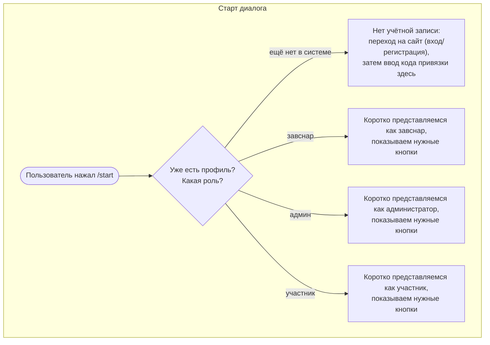

### Получить снаряжение

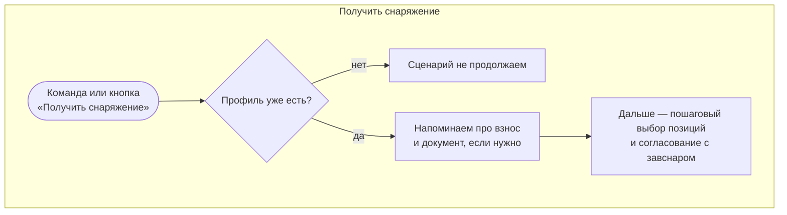

### Сдать снаряжение

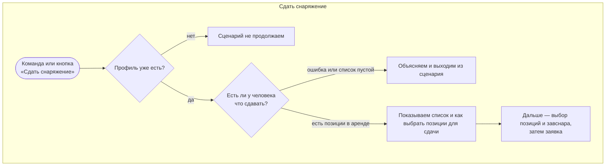

### Склад (просмотр позиций)

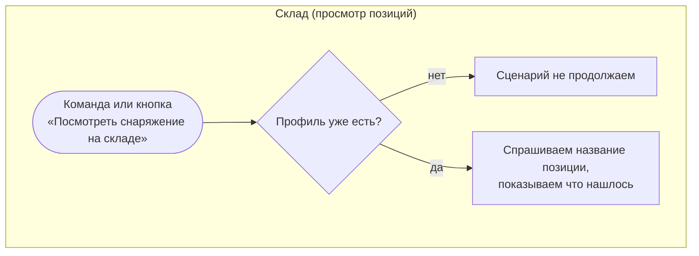

### Завснар или администратор

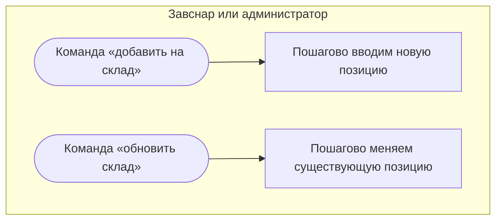

### Изменить тип залогового документа

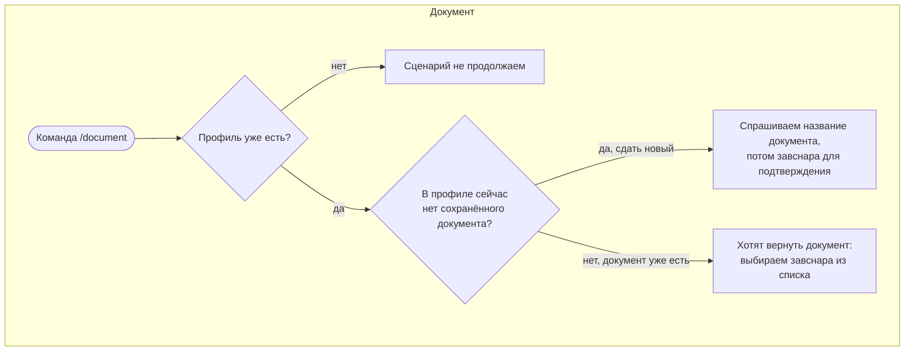

### Без шага диалога

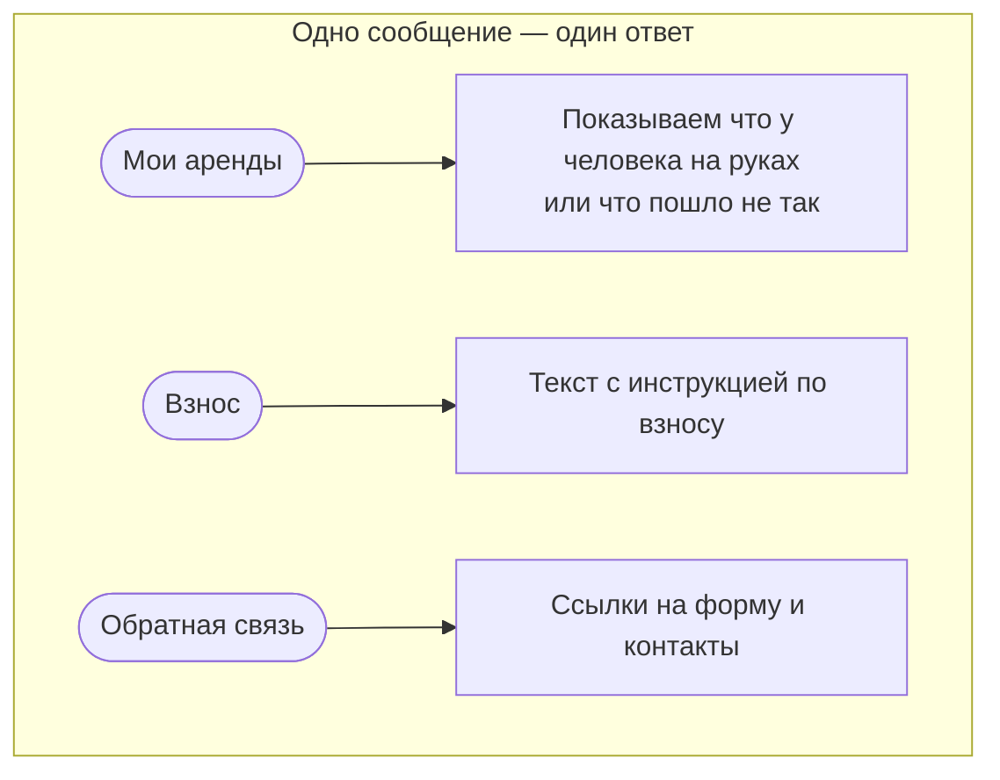

---

## 2. Регистрация и привязка мессенджера к аккаунту

Учётная запись создаётся или подтверждается **на сайте** (единая форма входа и регистрации). Бот участвует только на шаге **проверки кода**, который пользователь получает после успешного действия на сайте и вводит в чате, чтобы связать VK-id с уже существующим профилем.

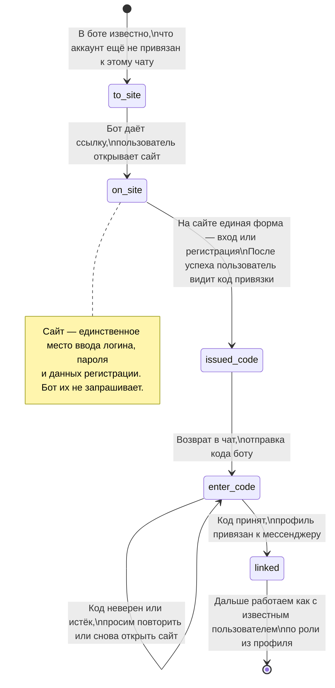

---

## 3. Получить снаряжение (пошагово)

В основном линейная цепочка; после подтверждения выбора можно снова **продолжить подбор** по названию.

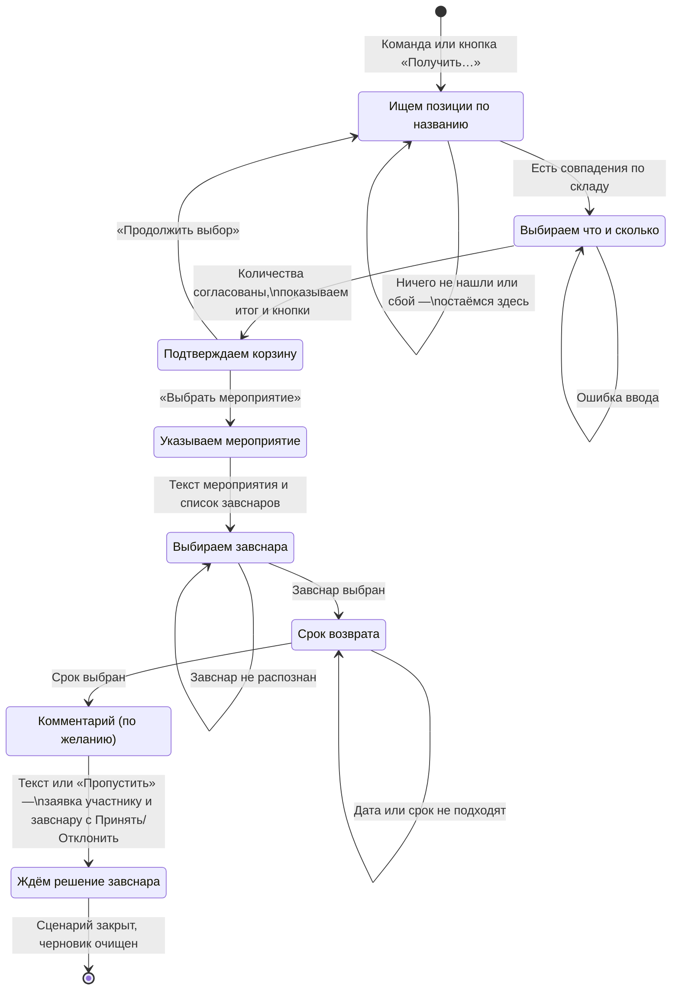

---

## 4. Сдать снаряжение

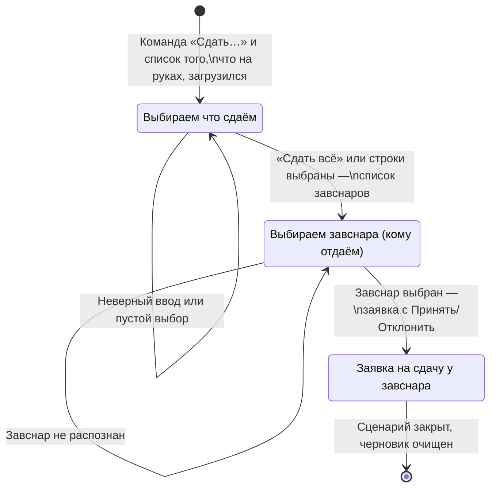

---

## 5. Завснар: новая позиция на складе

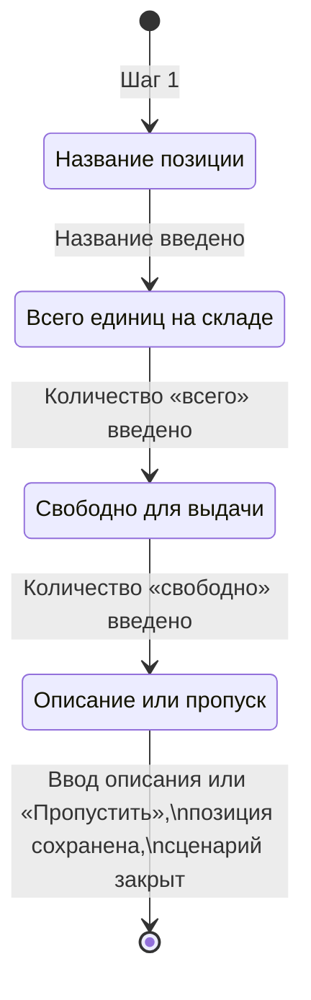

---

## 6. Завснар: правка существующей позиции

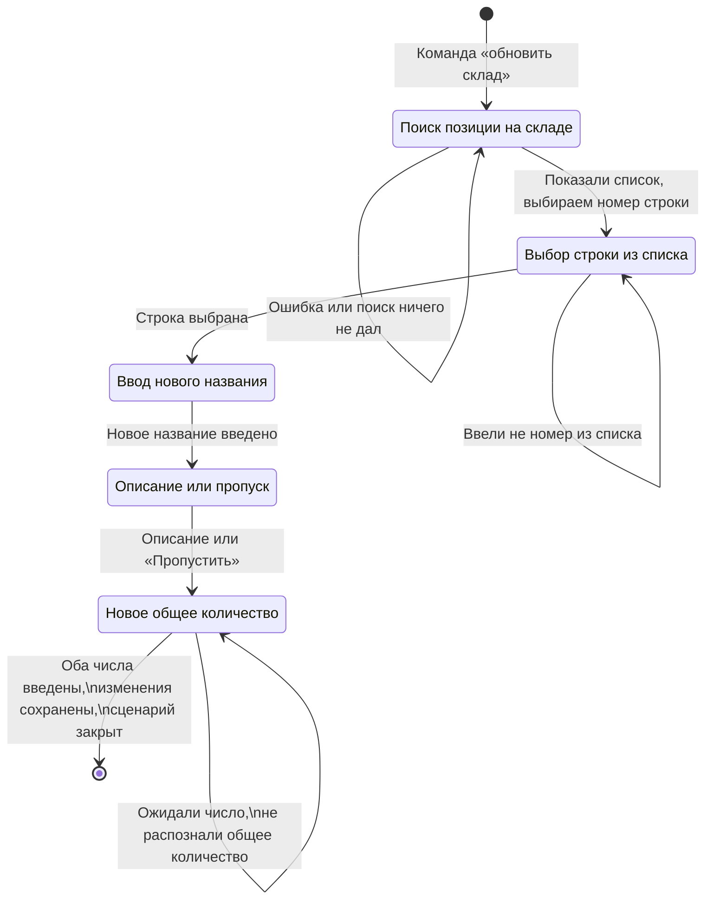

---

## 7. Поиск и просмотр снаряжения по названию

Доступен любому с профилем: участнику, завснару или администратору.

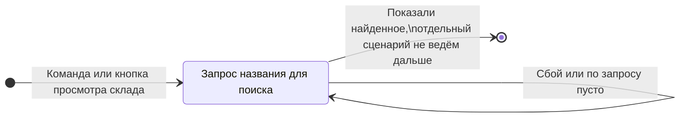

---

## 8. Изменить статус документа: сдать, изменить тип, получить

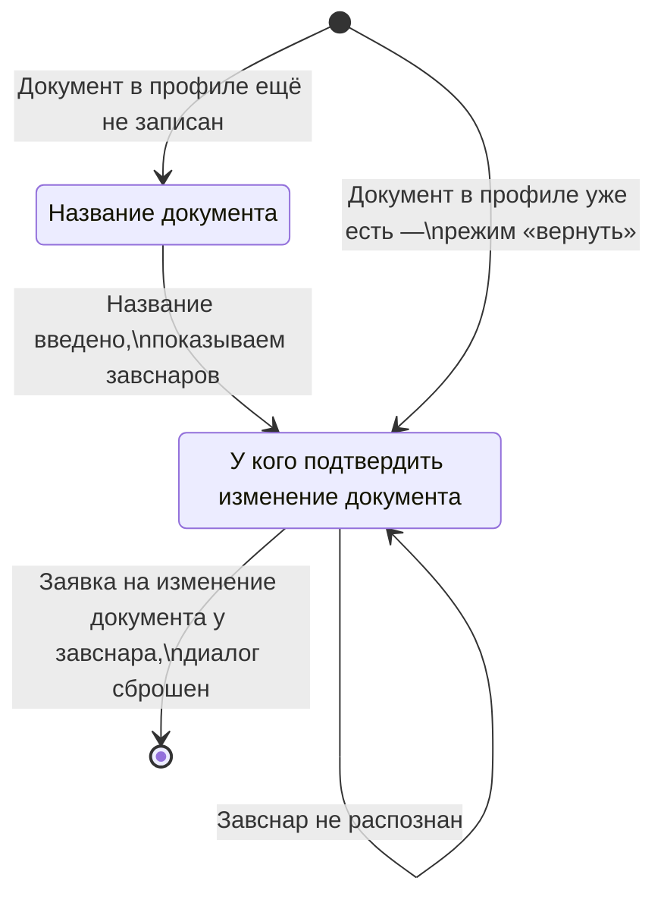

---

## 9. Флоу обработки заявок пользователя

### Последовательность

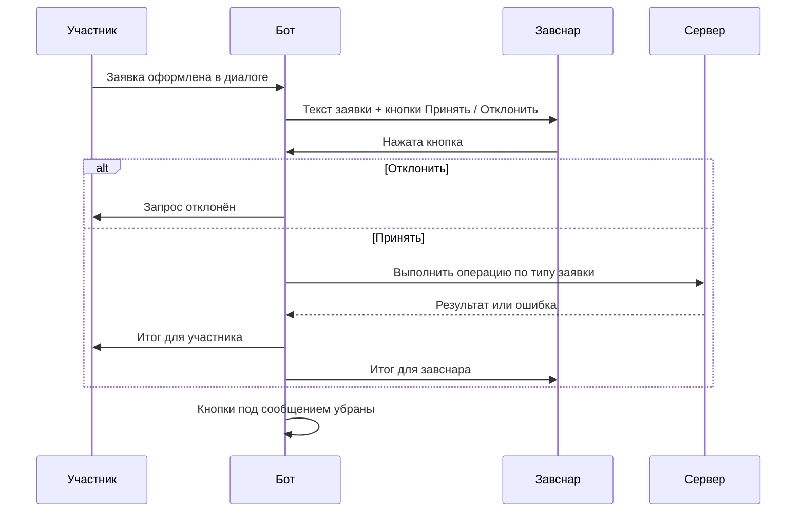

---
